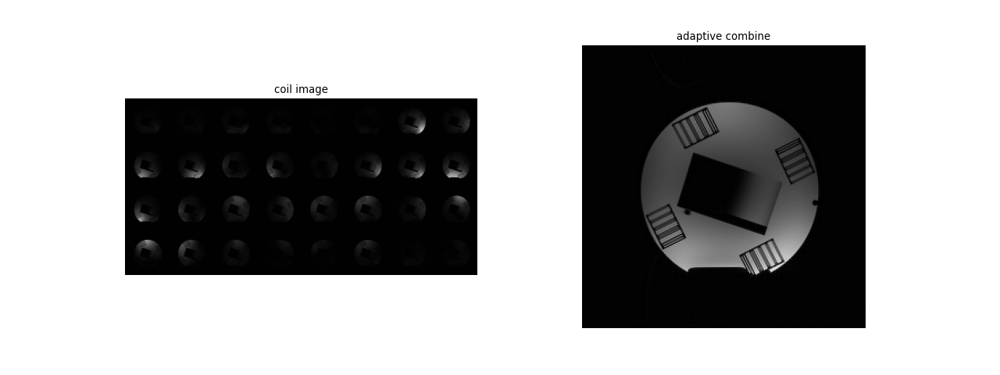
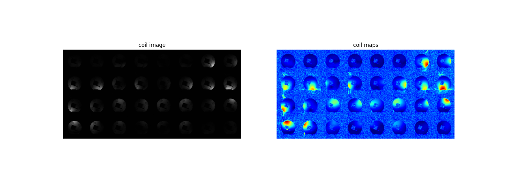
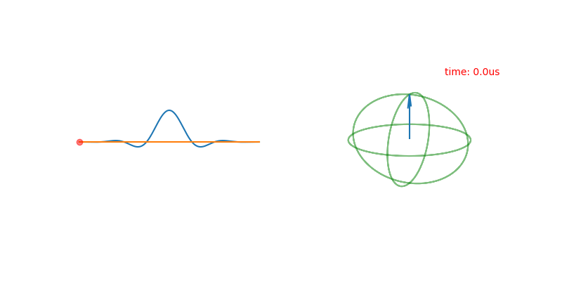
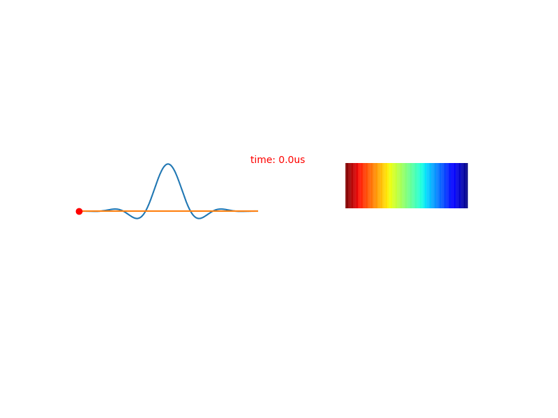
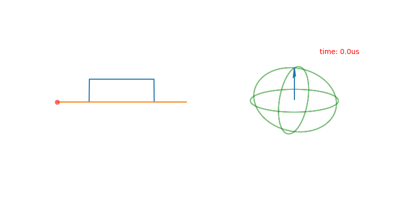
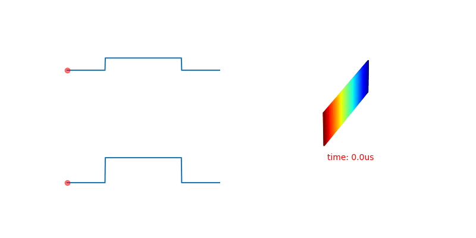

# MRI reconstruction tools

## Coil 

### adaptive combine

### coil maps

# MRI pulse sequence simualator 

## Sinc pulse

## Sinc pulse profile 

## Hard pulse 

## Hard pulse profile 

## TSE

## TSE 90-130-130-130

## bSSFP

