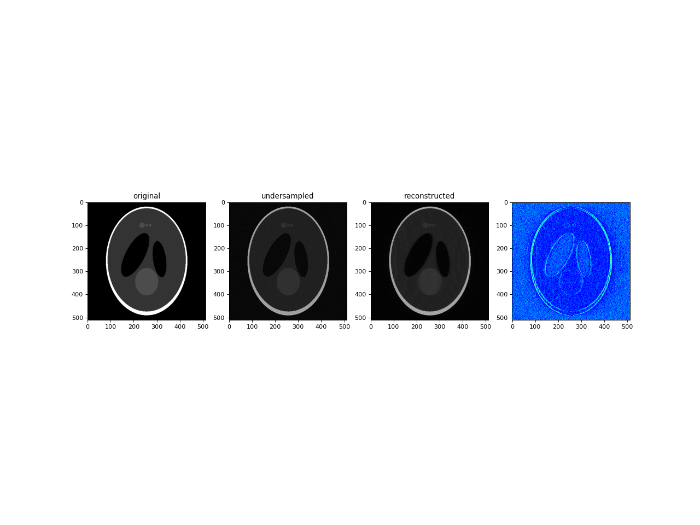
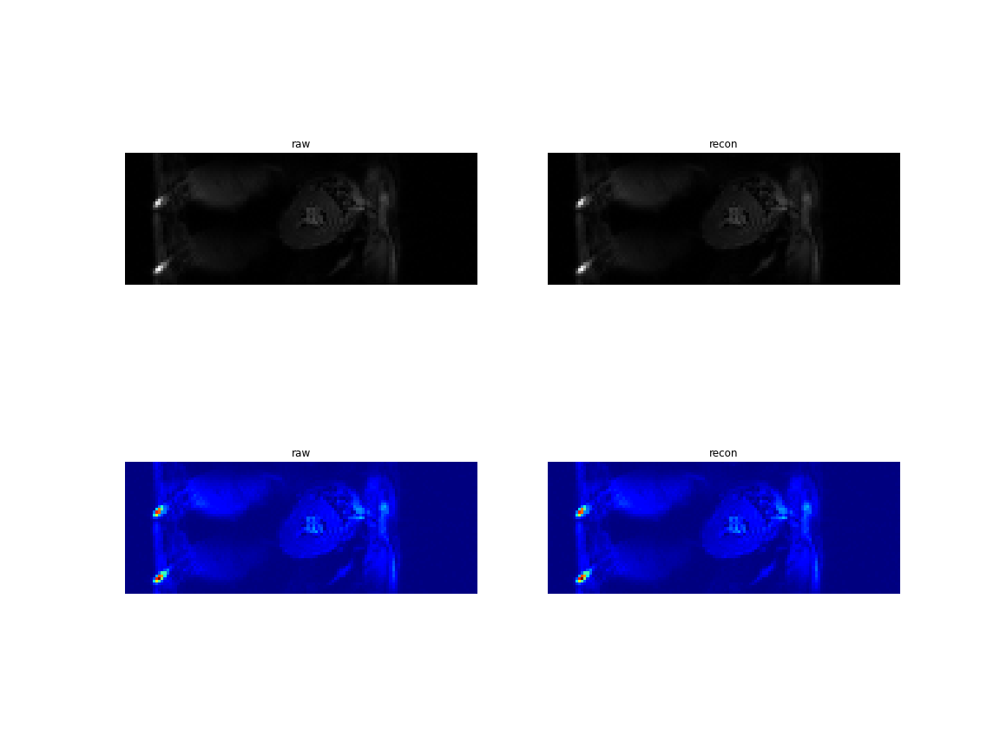
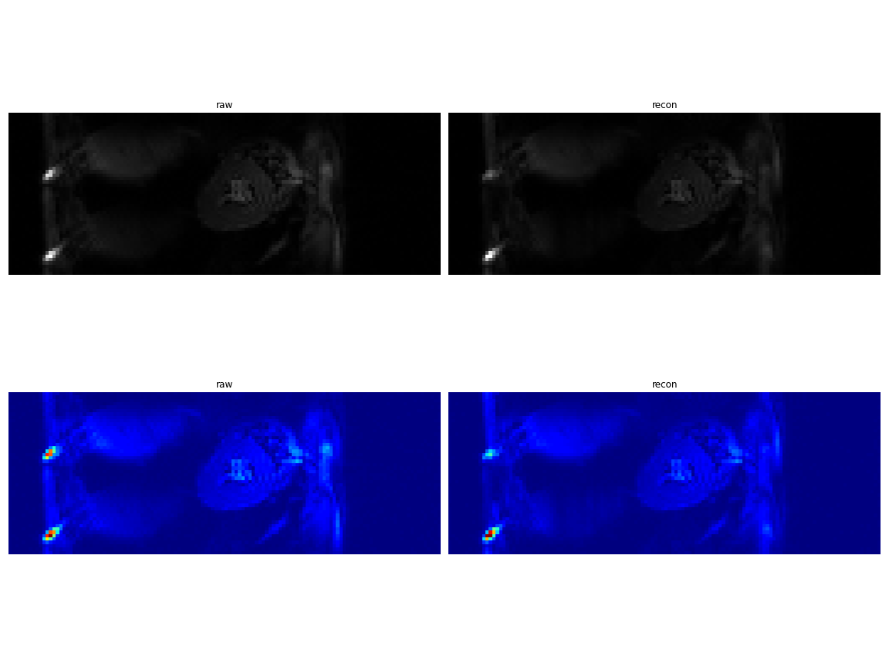
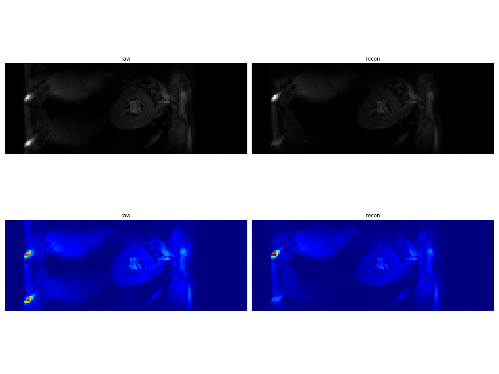
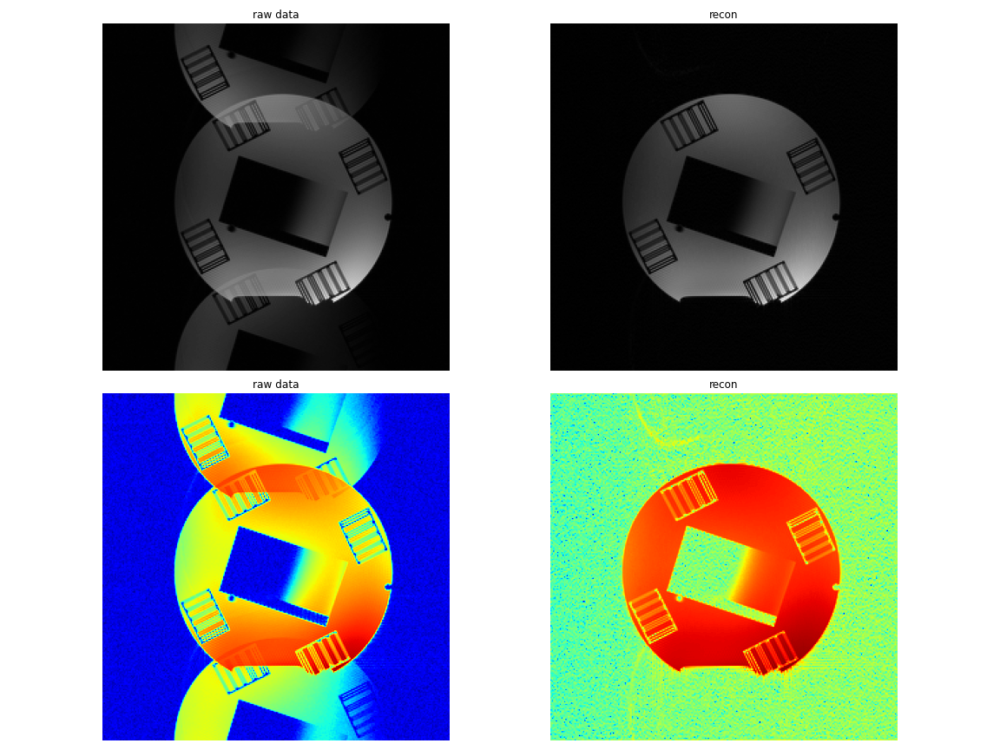
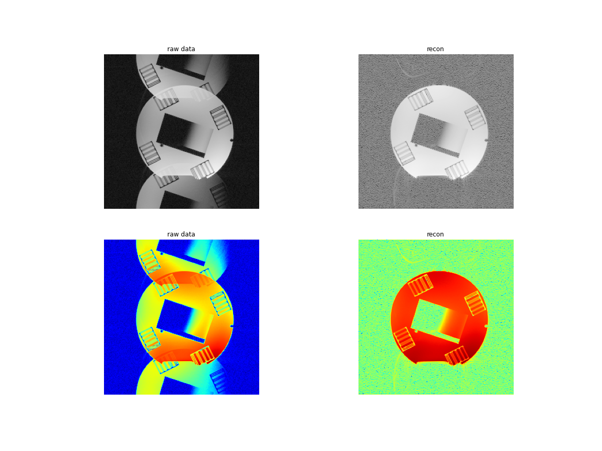

# MRI pulse sequence simualator 

alomost there upload code soon

## Sinc pulse

## Sinc pulse profile 

## Hard pulse 

## Hard pulse profile 

## TSE

## TSE 90-130-130-130

## bSSFP

# [MRI reconstruction tools](https://github.com/ZimuHuo/pymri_recon)

## Coil 

### [adaptive combine](https://github.com/ZimuHuo/pymri_recon/blob/main/coil/adaptive_combine.ipynb)

### [coil maps](https://github.com/ZimuHuo/pymri_recon/blob/main/coil/inati.ipynb)

## Compressed sensing 

### [Sparse](https://github.com/ZimuHuo/pymri_recon/tree/main/compress_sensing) 

## EPI ghost correction

### [EPI navigator phase correction average coil](https://github.com/ZimuHuo/pymri_recon/blob/main/EPI/avg_coil.ipynb)

### [EPI navigator phase correction per coil](https://github.com/ZimuHuo/pymri_recon/blob/main/EPI/per_coil.ipynb)

### [EPI entropy](https://github.com/ZimuHuo/pymri_recon/blob/main/EPI/entropy.ipynb)

### [EPI low rank](https://github.com/ZimuHuo/pymri_recon/blob/main/EPI/low%20rank.ipynb)

### [EPI PAGE](https://github.com/ZimuHuo/pymri_recon/blob/main/EPI/page.ipynb)

### [EPI PEC-SENSE](https://github.com/ZimuHuo/pymri_recon/blob/main/EPI/EPI_pecsense.png)

